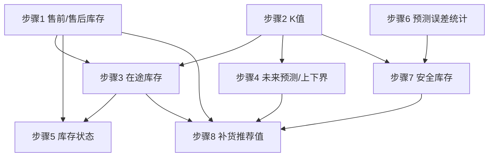

# 计算公式与配置文档

## 1. 文档目的

本文档定义 Sephora 补货推荐系统的核心计算公式与业务配置。主要内容包括：

- 每日补货订单推荐值计算公式；
- 安全库存计算方法；
- 补货滞后参数 `k`；
- 销量预测与预测误差标准差；
- 建议补货量；
- 库存覆盖天数与库存状态判定；
- 日均销量、畅销与滞销排序规则；
- 可配置项结构与校验规则。

当前版本预测目标统一为 `Units Sold`，`Demand` 暂不使用。所有计算以 `(Store ID, Product ID)` 为基本单位，不同门店/商品数据不混用。

---


## 2. 每日补货订单推荐值计算公式

每日订货量=max(0, 未来K天预测总销量−现有 - 在途库存 + 安全库存) 

其中：
- K： 下单到收货的滞后时间，正整数：比如今日下单，后天收货 K = 2
- 现有库存 = 当日库存 - 当天销量 （当前数据 Inventory Level 含义是当天销售前的库存水平）
- 在途库存 = 已下单还没到货的库存，前 K-1 天的补货订单量的和；例如 K = 2， 当日是第 0 天，前 K=2 天的货已经到货，计入当日库存。 前 K-1 = 1 天的货明天到货，计入在途库存。
- 安全库存计算公式见下文


## 3. 销量预测的计算

- 销量预测算法见 `project_docs/05-sales_forecast.md`。
- 预测算法已解耦为独立包 `forecast/`，通过 `forecast.calculator.EnsembleForecastCalculator` 计算，输入输出契约由 `forecast.schemas` 定义。离线批处理通过 `forecast.batch.run(...)` 统一调用，保证离线计算与销量预测充分解耦，方便后续升级销量预测算法而不影响整体离线流程。
- 对于一个日期 `D`（`forecast_origin_date`），预测未来 7 天的销量，即每一天对应 7 个预测值。
- 预测算法输出预测上、下界（95% 预测区间），一并保存到 `fact_forecast.csv`。
- 当前模型版本：`ensemble_v2`。

**数据量约束**：每个 `(store_id, product_id)` 组合需要至少 7 天历史数据（`MIN_INITIAL_HISTORY_DAYS`）才参与离线计算，与预测算法最低门槛一致，保证新上市 SKU 也能尽早获得预测支持。数据不足 7 天的组合将被跳过。此外，只对最近 33 天（`FORECAST_WINDOW_DAYS`）的 `forecast_origin_date` 生成预测（30 个误差样本 + 3 天 horizon 缓冲），减少计算量。

## 3. 安全库存

安全库存 = 服务水平系数 * 需求变动标准差 * 提前期0.5次方
即：
$$
\text{安全库存} = Z \times \sigma \times \sqrt{L}
$$

| 参数 | 含义 | 说明 |
|---|---|---|
| $Z$ | 服务水平系数 | 决定不缺货概率，如 $Z=1.65$ 对应 95% |
| $\sigma$ | 需求波动标准差 | 通常取预测误差的标准差 |
| $L$ | 提前期 | 当前场景下为补货滞后 `k` |

**参数影响**：
- 服务水平提高（$Z$ 增大），安全库存线性增加；
- 预测更准（$\sigma$ 减小），安全库存线性减少；
- 提前期缩短（$L$ 减小），安全库存按 $\sqrt{L}$ 减少。

### 3.1 Z 服务水平系数 **$Z$ 选择建议**：

| 场景             | 建议 $Z$             |
| -------------- | ------------------ |
| 畅销品/高利润品/缺货投诉多 | 1.65~2.33（95%-99%） |
| 普通品类           | 1.28~1.65（90%-95%） |
| 低值/易替代/长尾品     | 0.84~1.28（80%-90%） |
| 生鲜/保质期短        | 宁低勿高，0.5~1.0       |

注： 本期对所有品类选择 2.33 ： 简化计算

### 3.2 需求波动标准差计算

需求波动标准差取**预测误差的标准差**。离线批处理对每个 `(store_id, product_id)` 组合进行 walk-forward 预测：对每个有效的 `forecast_origin_date`，使用 `forecast.calculator.EnsembleForecastCalculator` 生成未来 7 天预测；当目标日期存在实际 `units_sold` 时，计算单日误差：

$$
e_D = y_D - \hat{y}_{D}
$$

其中 \(\hat{y}_{D}\) 为对应 `(origin_date, forecast_date)` 上的点预测值。

对补货基准日 `T`，取**固定提前期 horizon=3** 的历史预测误差，并在过去 **30 个自然日**的滚动窗口内计算样本标准差：

$$
\sigma_e = \sqrt{\frac{\sum_{D}(e_D - \bar{e})^2}{n-1}}
$$

其中：
- 仅使用 `forecast_date - forecast_origin_date == 3` 的预测误差；
- 窗口为 `[T - 29, T]`（共 30 个自然日），按 `forecast_origin_date` 落在窗口内的误差样本计算；
- \(n\) 为有效误差样本数，\(\bar{e}\) 为误差均值（样本标准差，ddof=1）。

- 若有效误差少于 2 个，使用 fallback 值 `sigma = 1.0`，并在 `fact_forecast_error_stats.std_source` 中标记为 `fallback_1`；
- 否则标记为 `calculated`。

误差统计结果持久化到 `fact_forecast_error_stats.csv`。该表除 `as_of_date`、`store_id`、`product_id`、`error_std` 外，还包含 `horizon`（固定值 `3`）与 `window_days`（固定值 `30`）字段，用于明确 sigma 的统计口径。补货计算与安全库存服务直接读取该表。

### 3.3 补货滞后参数 `K`

`k` 是 `(Store, Product)` 组合级别的参数，不能全局统一。

实际数据发现，对于单一门店、单一商品，`k` 的取值是固定的，因此不需要滚动计算。
`k` 基于最近 90 天的历史数据进行一次性估计，`k` 必须为非负整数。
`k` 作为一个维度按日常刷新。

**计算方式**：
1. 组合级别 `k[Store][Product]`：基于该 `(Store, Product)` 最近 90 天历史数据估计；


## 4. 其他指标计算
### 4.1 日均销量
```text
日均销量 = 累计销量 / 时间范围内的日历天数
```
90天内滚动计算


### 4.2 库存覆盖天数

```text
不含在途库存覆盖天数 = (当前库存) / 日均销量
含在途库存覆盖天数 = (当前库存 + 在途库存) / 日均销量
```
日均销量为 0 时，覆盖天数显示 `N/A` ，避免显示无限大。

### 4.2 库存状态

默认基于含在途库存覆盖天数：

| 覆盖天数 | 状态 |
|---:|---|
| `< 2` | 紧缺 |
| `>= 2 且 < 4` | 偏低 |
| `>= 4 且 <= 7` | 正常 |
| `> 7` | 充足 |

可通过 `inventory_status.basis` 切换：

- `on_hand_inventory`：只使用当前库存；
- `total_inventory`：使用当前库存加在途库存（默认）。

### 4.3 畅销与滞销排序

默认指标：时间范围内累计 `Units Sold`。

- Top 5：降序；
- Bottom 5：升序；
- 销量相同时按 `Product ID` 升序稳定排序。

---

## 5. 可配置项

```yaml
default:
  store_id: S001
  time_range_days: 90

ranking:
  metric: units_sold
  top_n: 5
  bottom_n: 5

lead_time:
  estimation_window_days: 90
  min_days: 0
  max_days: 7
  fallback_days: 2

safety_stock:
  service_level_z: 2.33
  error_window_days: 30
  insufficient_error_std: 1

forecast:
  error_horizon: 3
  error_window_days: 30

offline:
  output_dir: data/processed_data
  as_of_date_offset_days: 7

inventory_status:
  basis: total_inventory
  method: coverage_days
  critical_less_than: 2
  low_less_than: 4
  normal_less_than_or_equal: 7
```


# 6. 计算流程

本章说明离线批处理的完整计算流程。所有步骤以 `(Store ID, Product ID)` 组合为基本单位，不同门店/商品数据不混用；每个组合按日刷新，输出面向当日（`T` 日）的库存与补货指标。

## 6.0 前置约定

- **当日 `T`**：本次计算的基准日期，默认取组合可用数据的最新一天减去 `offline.as_of_date_offset_days`（当前为 7 天），与在线服务读取预计算表时使用的 `as_of_date` 保持一致。
- **历史窗口**：日均销量、`k` 估计取最近 90 天；预测误差标准差取**固定 horizon=3 + 最近 30 天**滚动窗口；两者均按“不足则用全部可用数据”处理。
- **数据来源**：`Date + Store ID + Product ID` 粒度的 `Inventory Level`、`Units Sold`、`Units Ordered`，字段含义见《数据探索说明文档》。
- **依赖关系**：后序步骤依赖前序步骤的输出，须按下列顺序执行。

## 6.1 计算步骤

### 步骤 1：当日售前 / 售后库存

- **输入**：`T` 日的 `Inventory Level`、`Units Sold`。
- **计算**：
  - 售前库存 = `Inventory Level`（当天销售前的库存水平）；
  - 售后库存（现有库存）= `Inventory Level − Units Sold`。
- **输出**：`on_hand_inventory`（现有库存），供步骤 3、5、8 使用。

### 步骤 2：K 值计算（补货滞后）

- **输入**：该组合历史数据（估计窗口）。
- **计算**：按 3.3 节的估计方法一次性计算 `k`（非负整数），在整个 Demo 周期内固定，不随日刷新。结果持久化到维度表 `fact_lead_time`，后续步骤直接读取，不重复估计。
- **输出**：写入 `fact_lead_time`，供步骤 3、4、7、8 直接查询 `effective_lead_time_days`。

`fact_lead_time` 维度表主要字段：

| 字段 | 说明 |
|---|---|
| `store_id` / `product_id` | 组合主键 |
| `lead_time_days` | 原始估计的 K |
| `effective_lead_time_days` | 实际计算使用的 K（`lead_time_days = 0` 时取 1） |
| `k_source` | `estimated`（估计得到）或 `default`（回退默认值） |
| `selected_mse` | 最优 K 的 MSE |
| `estimation_window_start` / `estimation_window_end` | 估计数据窗口 |
| `calculated_at` / `config_version` | 计算时间与配置版本 |

### 步骤 3：在途库存计算

- **输入**：`k`、最近若干日的 `Units Ordered`。
- **计算**：在途库存 = 前 `K−1` 天的补货订单量之和（前 `K` 天的货已到货并计入当日库存）。当 `k ≤ 1` 时在途库存为 0。
- **输出**：`in_transit_inventory`，供步骤 5、8 使用。

### 步骤 4：未来预测值及预测上下界

- **输入**：该组合最近 90 天 `Units Sold` 序列、`k`。
- **计算**：调用 `forecast.calculator.EnsembleForecastCalculator.predict(...)`，按 `project_docs/05-sales_forecast.md` 生成未来 7 天每日预测值 $\hat{y}_i$ 及 95% 预测上下界；补货所需的“未来 K 天预测总销量”取前 `k` 天预测值之和。
- **输出**：`forecast[1..7]`、预测上下界、`future_k_days_demand`（供步骤 8 使用）。预测结果持久化到 `fact_forecast.csv`。

### 步骤 5：库存状态计算

- **输入**：现有库存、在途库存、日均销量（4.1 节）。
- **计算**：按 4.2 节先算库存覆盖天数，再按阈值判定紧缺 / 偏低 / 正常 / 充足；基准由 `inventory_status.basis` 决定（默认含在途库存）。日均销量为 0 时覆盖天数记为 `N/A`。
- **输出**：`coverage_days`、`inventory_status`。

### 步骤 6：预测误差统计

- **输入**：`fact_forecast.csv` 中每个 `(store_id, product_id)` 组合的历史预测误差（`forecast_error` 字段）。
- **计算**：对补货基准日 `T`，取**固定 horizon=3** 的预测误差，并在过去 **30 个自然日**的 `forecast_origin_date` 窗口内按第 3.2 节计算样本标准差 $\sigma_e$；有效误差少于 2 个时 fallback 为 `1.0`。
- **输出**：$\sigma_e$ 持久化到 `fact_forecast_error_stats.csv`，供步骤 7 使用。

### 步骤 7：安全库存计算

- **输入**：服务水平系数 $Z$（默认 2.33）、$\sigma_e$、提前期 $L = k$。
- **计算**：按第 3 节公式 $\text{安全库存} = Z \times \sigma_e \times \sqrt{L}$。
- **输出**：`safety_stock`，供步骤 8 使用。

### 步骤 8：当日补货单推荐值

- **输入**：未来 K 天预测总销量、现有库存、在途库存、安全库存。
- **计算**：按第 2 节公式

  $$
  \text{推荐订货量} = \max\big(0,\; \text{未来K天预测总销量} - \text{现有库存} - \text{在途库存} + \text{安全库存}\big)
  $$

  结果向上圆整为整数。
- **输出**：`recommended_order_qty`（当日补货推荐值）。

## 6.2 步骤依赖关系



## 6.3 输出汇总

| 输出项 | 来源步骤 | 说明 |
|---|---|---|
| `on_hand_inventory` | 1 | 现有库存（售后库存） |
| `k` | 2 | 组合级补货滞后 |
| `in_transit_inventory` | 3 | 在途库存 |
| `forecast[1..7]` / 上下界 | 4 | 未来 7 天预测 |
| `coverage_days` / `inventory_status` | 5 | 库存覆盖天数与状态 |
| $\sigma_e$ | 6 | 预测误差标准差 |
| `safety_stock` | 7 | 安全库存 |
| `recommended_order_qty` | 8 | 当日补货推荐值（整数） |


`fact_forecast_error_stats` 表字段：

| 字段 | 类型 | 说明 |
|---|---|---|
| `as_of_date` | date | 误差统计截至日期 |
| `store_id` | string | 门店编号 |
| `product_id` | string | 商品编号 |
| `horizon` | integer | 固定误差提前期，本期为 `3` |
| `window_days` | integer | 滚动窗口天数，本期为 `30` |
| `error_std` | decimal | 预测误差标准差 |
| `valid_error_count` | integer | 有效误差数量 |
| `std_source` | string | `calculated` 或 `fallback_1` |
| `model_version` | string | 模型版本 |
| `calculated_at` | timestamp | 计算时间 |

## 7. 离线计算模块

离线计算模块位于 `offline_calculation/`，通过单一命令执行全部计算任务：

```bash
python -m offline_calculation
```

输出目录为 `data/processed_data/`。模块与其他服务充分解耦，可独立运行。